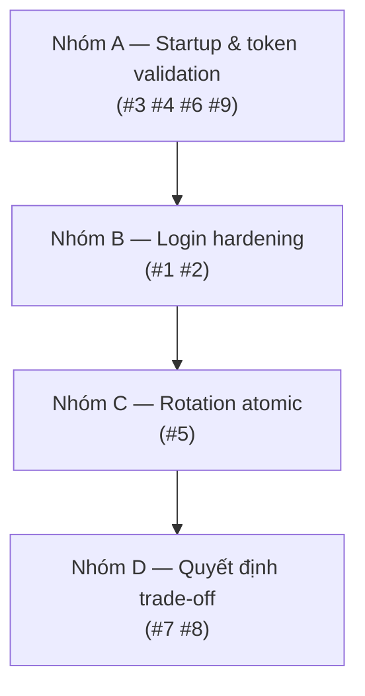
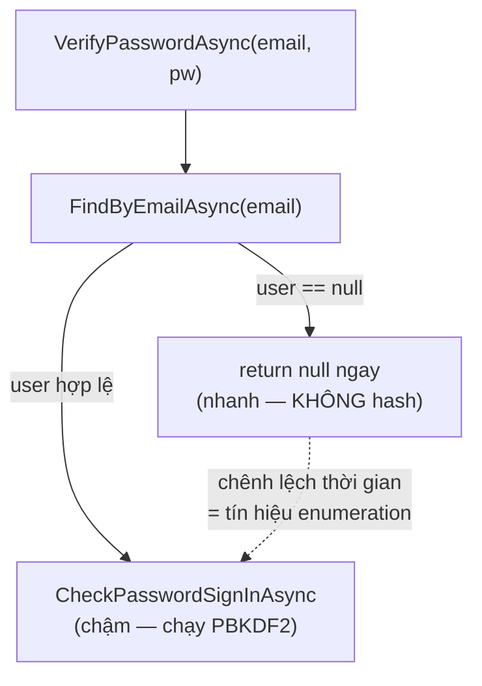
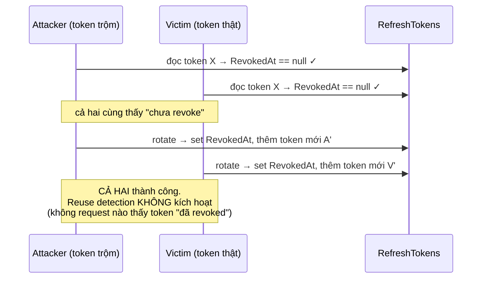

# Bước 7 (bổ sung). Vá 9 lỗ hổng từ security review

> **Mentor mode.** Tài liệu giải thích *vì sao* và *làm gì*, **không kèm code C#**, bạn tự gõ. Lệnh CLI thì cứ chạy theo.
>
> Bước này sinh ra **sau** khi bạn đã hoàn thành Day 4 (Bước 1–6) và chạy review bảo mật module Identity. Không phải bước bắt buộc để "chạy được", mà là bước biến luồng auth từ *hoạt động* thành *đứng vững trước tấn công* — và mỗi ý ở đây là một câu chuyện kể được khi phỏng vấn.

---

## 7.0. Bối cảnh: review tìm ra gì

Agent `security-reviewer` quét `src/Modules/Identity/**` + wiring ở Bootstrap, ra **9 phát hiện — 0 🔴, 5 🟡, 4 🔵**. Không có lỗ hổng chiếm quyền ngay: secret không bị commit, `TokenValidationParameters` bật đủ 4 validate, endpoint admin có `RequireRole`. Chín ý còn lại đều thuộc nhóm "làm yếu phòng thủ" hoặc "gia cố" — đúng loại việc để nâng một bài tập lên mức kể được.

| # | Mức | Lỗ hổng | Chạm file |
|---|-----|---------|-----------|
| 1 | 🟡 | Không có lockout — brute-force online không giới hạn | `Infrastructure/DependencyInjection.cs`, `Infrastructure/Authentication/IdentityService.cs` |
| 2 | 🟡 | User enumeration qua timing ở login | `IdentityService.VerifyPasswordAsync` |
| 3 | 🟡 | `ClockSkew` để mặc định 5 phút | `DependencyInjection.cs` (`TokenValidationParameters`) |
| 4 | 🟡 | Guard signing key chỉ bắt `null`, lọt chuỗi rỗng/key ngắn | `DependencyInjection.cs:44`, `JwtTokenGenerator.cs:35` |
| 5 | 🟡 | TOCTOU race trong rotation — hai request song song cùng token đều lọt | `IdentityService.RotateRefreshTokenAsync` |
| 6 | 🔵 | Không pin `alg` chấp nhận | `DependencyInjection.cs` (`TokenValidationParameters`) |
| 7 | 🔵 | Refresh token đi trong body (dễ vào log) thay vì cookie `HttpOnly` | `Api/Endpoints/IdentityCoreEndpoints.cs`, `AuthResult` |
| 8 | 🔵 | Register trả 409 → lộ email đã tồn tại | `IdentityCoreEndpoints.cs` (route register) |
| 9 | 🔵 | Config thiếu → `AccessTokenLifetimeMinutes = 0` âm thầm | gộp vào #4 (options validation) |

## 7.1. Thứ tự vá (làm từ rẻ & độc lập → sâu)

Ba nhóm. Làm tuần tự, **`dotnet build EventHub.slnx` xanh sau mỗi nhóm** rồi mới sang nhóm sau.

Nhóm A đứng trước vì chỉ đụng `DependencyInjection.cs` — sửa một chỗ, build lại, thấy hiệu ứng ngay (startup fail-fast). Nhóm D để cuối vì là **quyết định của bạn**, có thể chỉ ghi nhận trade-off chứ không nhất thiết viết code.

---

## Nhóm A — Startup & token validation

Cả nhóm này gói gọn trong `AddInfrastructure` (`Infrastructure/DependencyInjection.cs`) — nơi hiện dựng `TokenValidationParameters` và guard signing key.

### A1 (#4 + #9) — Validate config fail-fast, không chỉ chống `null`

**Cái gì.** Hiện tại `DependencyInjection.cs:44` viết `jwtOptions.SigningKey ?? throw ...` và `JwtTokenGenerator.cs:35` lặp lại. `??` **chỉ** bắt `null`. Ba lỗ:

- `"SigningKey": ""` (chuỗi rỗng) hoặc toàn khoảng trắng → lọt qua `??`, app chạy với key rỗng.
- `"SigningKey": "dev-key-123"` (key ngắn) → lọt, và HS256 với key ngắn thì brute-force offline được từ **một** access token bất kỳ (hashcat mode 16500). Kẻ tấn công tự ký token `role=Admin` → chiếm mọi endpoint admin.
- `AccessTokenLifetimeMinutes` vắng trong config → `int` nhận `0` → `JwtTokenGenerator.cs:37` cộng 0 phút → token chết ngay khi sinh. Không phải lỗ hổng, nhưng là fail âm thầm.

**Vì sao chặn ở startup.** Nguyên tắc fail-fast: một cấu hình sai phải làm app **không khởi động được**, kèm message nói rõ sai gì — thay vì chạy ngầm rồi hỏng ở request thứ N (khó truy). Signing key yếu là lỗi bảo mật nghiêm trọng nhất mà lại dễ lọt nhất, nên đáng một guard riêng.

**Các bước làm.**

1. Sau khi có `jwtOptions` (dòng 38), thay guard `?? throw` bằng một khối kiểm tra gom:
   - `string.IsNullOrWhiteSpace(jwtOptions.SigningKey)` → ném `InvalidOperationException` với message yêu cầu đặt `Jwt:SigningKey` ở User Secrets.
   - Độ dài byte: `Encoding.UTF8.GetBytes(jwtOptions.SigningKey).Length >= 32` (256 bit — mức tối thiểu khuyến nghị cho HS256). Ngắn hơn → ném, message nói rõ "cần ≥ 32 byte".
   - `jwtOptions.AccessTokenLifetimeMinutes > 0` và `jwtOptions.RefreshTokenLifetimeDays > 0` → ném nếu ≤ 0.
   - Gợi ý gọn: gom bốn điều kiện này vào một `private static void ValidateJwtOptions(JwtOptions options)` cùng file `DependencyInjection.cs`, gọi một lần sau khi bind. Đặt ở đây (không phải trong `JwtOptions`) vì `JwtOptions` là POCO config thuần, không nên biết luật validate.
2. Vì key đã được đảm bảo hợp lệ ở A1, guard `?? throw` trùng lặp trong `JwtTokenGenerator.cs:35` giờ thành thừa — có thể để lại như một lớp phòng thủ, nhưng đừng coi nó là nơi validate chính.

**Cách "đúng ngành" hơn (tùy chọn, khuyến nghị khi có thời gian).** .NET có sẵn options-validation-on-start: `services.AddOptions<JwtOptions>().Bind(configuration.GetSection(JwtOptions.SectionName)).Validate(o => !string.IsNullOrWhiteSpace(o.SigningKey) && Encoding.UTF8.GetBytes(o.SigningKey).Length >= 32, "...").Validate(o => o.AccessTokenLifetimeMinutes > 0, "...").ValidateOnStart()`. `ValidateOnStart()` chạy validate lúc app khởi động thay vì lúc `IOptions<T>` được resolve lần đầu — đúng tinh thần fail-fast. Đánh đổi: bạn phải chuyển từ `AddSingleton(jwtOptions)` sang inject `IOptions<JwtOptions>` (hoặc `.Value`) ở `JwtTokenGenerator`/`IdentityService`. Nếu chưa muốn đụng nhiều, dùng khối guard tay ở trên trước; refactor sang options pattern là một bước dọn về sau.

> **Verify A1:** tạm để `"Jwt:SigningKey": ""` trong User Secrets rồi `dotnet run` → app phải **crash lúc startup** với message của bạn, không phải chạy rồi lỗi ở `/login`. Trả key hợp lệ về sau khi thử.

### A2 (#3) — `ClockSkew = TimeSpan.Zero`

**Cái gì.** `TokenValidationParameters` ở `DependencyInjection.cs:48-58` không set `ClockSkew`. Property này kiểu `TimeSpan`, **mặc định 5 phút** — dung sai lệch giờ giữa server phát và server verify.

**Vì sao Zero ở đây.** Access token của bạn sống ngắn (đặt trong `AccessTokenLifetimeMinutes`, ví dụ 15 phút). Skew mặc định 5 phút nghĩa là token đã hết hạn theo thiết kế vẫn được chấp nhận thêm 5 phút — với token 15 phút là **sống lố 33%**. Kẻ tấn công cầm token đánh cắp có thêm 5 phút vàng sau khi bạn tưởng nó đã chết. Ở EventHub, server phát và server verify là **cùng một process** (modular monolith), không có lệch đồng hồ giữa các node → dung sai này vô nghĩa, đặt `TimeSpan.Zero` là hợp lý và giải thích được.

**Các bước làm.** Thêm một property `ClockSkew = TimeSpan.Zero` vào object khởi tạo `TokenValidationParameters`. Nếu sau này tách thành nhiều host và lo lệch giờ thật, nâng lên `TimeSpan.FromSeconds(30)` — quan trọng là con số **có chủ đích**, không phải mặc định vô tình.

### A3 (#6) — Pin `ValidAlgorithms = ["HS256"]`

**Cái gì.** Token sinh ra cố định `HmacSha256` (`JwtTokenGenerator.cs:36`), nhưng `TokenValidationParameters` không giới hạn thuật toán chấp nhận khi verify.

**Vì sao.** Đây là lớp phòng thủ tường minh chống họ tấn công "algorithm confusion" (kinh điển: ép server hiểu một token `alg=none`, hoặc RS↔HS confusion). Với key đối xứng + `ValidateIssuerSigningKey = true`, handler hiện đại (`JsonWebTokenHandler`) đã chặn `none` mặc định, nên rủi ro thực tế thấp — vì vậy ý này xếp 🔵. Nhưng pin cứng danh sách thuật toán để **không phụ thuộc hành vi mặc định của thư viện** là thói quen tốt và gần như miễn phí.

**Các bước làm.** Thêm `ValidAlgorithms = [SecurityAlgorithms.HmacSha256]` (kiểu `IList<string>`/`IEnumerable<string>`; hằng `SecurityAlgorithms.HmacSha256` ở `Microsoft.IdentityModel.Tokens`, giá trị `"HS256"`) vào `TokenValidationParameters`.

> **Verify Nhóm A:** `dotnet build EventHub.slnx` xanh; `dotnet run` khởi động bình thường với config hợp lệ; login vẫn trả token, gọi endpoint bảo vệ vẫn 200.

---

## Nhóm B — Login hardening

### B1 (#1) — Bật lockout

**Cái gì.** `DependencyInjection.cs:33-35` mới `AddIdentityCore().AddRoles().AddEntityFrameworkStores()` — **không** có `SignInManager`. Vì thế `IdentityService.VerifyPasswordAsync` (`IdentityService.cs:47`) dùng `UserManager<ApplicationUser>.CheckPasswordAsync(user, password)` — hàm này **không** tăng `AccessFailedCount`, nên `LockoutEnabled`/`LockoutEnd` trên `ApplicationUser` là cột chết. Kẻ tấn công dò được một email hợp lệ (qua #8) rồi bắn dictionary attack vào `/identity/login` với tốc độ tùy ý; không gì chặn ngoài tốc độ PBKDF2.

**Vì sao dùng `SignInManager` chứ không tự đếm.** Lockout đúng cách gồm: đếm số lần sai (`AccessFailedCount`), khóa sau ngưỡng (`MaxFailedAccessAttempts`), tự mở sau `DefaultLockoutTimeSpan`, và reset counter khi đăng nhập đúng. `SignInManager<TUser>.CheckPasswordSignInAsync(TUser user, string password, bool lockoutOnFailure)` (trả `Task<SignInResult>`) làm hết chuỗi đó khi truyền `lockoutOnFailure: true`. Tự viết là dựng lại một bánh xe dễ sai.

**Các bước làm.**

1. **DI:** nối `.AddSignInManager()` vào chuỗi `AddIdentityCore<ApplicationUser>()...` trong `DependencyInjection.cs`. `SignInManager` được đăng ký sẵn để inject.
2. **Đổi `VerifyPasswordAsync` (Infrastructure):** inject thêm `SignInManager<ApplicationUser>` vào primary constructor của `IdentityService`. Sau `FindByEmailAsync`, thay `CheckPasswordAsync` bằng `signInManager.CheckPasswordSignInAsync(user, password, lockoutOnFailure: true)`. Kiểm `SignInResult.Succeeded` — đúng thì trả `user.Id`, sai (kể cả `IsLockedOut`) thì trả `null`.
   - **Giữ chữ ký `Task<Guid?> VerifyPasswordAsync(string email, string password)` như cũ** — không đổi interface. Lý do: khi bị khóa, ta vẫn trả `null` → endpoint vẫn `Results.Unauthorized()` với thông báo chung. **Không** trả riêng "tài khoản bị khóa" ra client, vì đó lại là một kênh enumeration mới (kẻ tấn công biết email nào tồn tại vì chỉ email thật mới khóa được). Cái lợi cốt lõi ở đây là `AccessFailedCount` **tăng** — điều `CheckPasswordAsync` không làm.
3. **Gotcha `LockoutEnabled`:** lockout chỉ chạy khi `user.LockoutEnabled == true`. `UserManager.CreateAsync` đặt cờ này theo `IdentityOptions.Lockout.AllowedForNewUsers` (mặc định `true`), nên user tạo qua `RegisterUserAsync` đã bật sẵn — nhưng user **seed** (nếu bạn tạo tay trong `IdentitySeeder`) thì kiểm lại cờ này, kẻo admin không bao giờ bị khóa.
4. **DI lifetime:** `SignInManager` là Scoped (đụng `HttpContext`/`UserManager` Scoped) → `IdentityService` vốn đã `AddScoped` nên khớp, không cần đổi.

> **Verify B1:** gọi `/identity/login` sai mật khẩu nhiều lần (mặc định 5) cho một user thật → lần kế dù **đúng** mật khẩu cũng bị từ chối trong `DefaultLockoutTimeSpan` (mặc định 5 phút). Kiểm cột `AccessFailedCount`/`LockoutEnd` trong bảng `AspNetUsers` thấy tăng.

### B2 (#2) — Chặn user enumeration qua timing

**Cái gì.** `VerifyPasswordAsync` (`IdentityService.cs:44-45`): khi `FindByEmailAsync` trả `null`, hàm return ngay **không chạy hash**. Body và status đã chung chung (đúng), nhưng *thời gian* phản hồi rò: email không tồn tại → trả lời sau ~vài ms (một query DB); email tồn tại → phải chạy PBKDF2 (hàng chục–trăm ms). Đo trung bình vài request là phân loại được email nào có tài khoản.

**Vì sao vá dù đã 🟡.** Kết hợp với #8 (register lộ 409) và #1 (không lockout — trước khi vá B1), timing tạo thành một pipeline: *enumerate email → xác nhận tồn tại → brute-force*. Vá timing cắt mắt xích đầu.

**Các bước làm.**

1. Inject `IPasswordHasher<ApplicationUser>` vào `IdentityService`.
2. Chuẩn bị **một** dummy hash cố định, tính sẵn một lần: `private static readonly string DummyHash = ...` — giá trị là kết quả `passwordHasher.HashPassword(new ApplicationUser(), "<mật khẩu ngẫu nhiên bất kỳ>")` tính lúc khởi tạo (hoặc hằng chuỗi hash bạn sinh sẵn). Mục đích là có sẵn một chuỗi PBKDF2 hợp lệ để "verify giả".
3. Trong nhánh `user == null`: gọi `passwordHasher.VerifyHashedPassword(new ApplicationUser(), DummyHash, password)` (chữ ký `PasswordVerificationResult VerifyHashedPassword(TUser user, string hashedPassword, string providedPassword)`) — **bỏ kết quả**, chỉ để tốn thời gian tương đương một lần hash — rồi mới `return null`. Giờ hai nhánh tốn thời gian gần bằng nhau.
   - **Gotcha:** đừng để compiler/JIT loại bỏ lời gọi "vô dụng" — gán kết quả vào một biến discard `_` là đủ giữ. Và dùng đúng thuật toán/iteration mà `IPasswordHasher` mặc định để thời gian khớp thật.
   - **Micro-gotcha bố cục:** nếu bạn đã đổi sang `CheckPasswordSignInAsync` ở B1, thứ tự vẫn là `FindByEmailAsync` trước; chỉ chèn dummy-verify vào đúng nhánh null.
4. Đây là mức "đủ tốt cho học tập". Ghi rõ trong `notes.md` rằng đây là một *mitigation*, không phải chống timing tuyệt đối (còn khác biệt do cache, GC...) — nói được giới hạn của giải pháp cũng là điểm cộng phỏng vấn.

> **Verify B2:** khó đo bằng mắt; đủ khi bạn giải thích được cơ chế. Nếu muốn, đo thô bằng `curl -w "%{time_total}"` cho email tồn tại vs không tồn tại — sau vá, hai con số phải xích lại gần nhau (trước vá thường chênh rõ).

---

## Nhóm C — Rotation atomic (#5)

**Cái gì.** `RotateRefreshTokenAsync` (`IdentityService.cs:63-99`) hiện: đọc token (`FirstOrDefaultAsync`), check `RevokedAt` **trong bộ nhớ**, rồi mới `SaveChangesAsync`. Nhánh revoke-all-khi-reuse (dòng 77-80) đã dùng `ExecuteUpdateAsync` atomic — tốt. Nhưng bước revoke **token hiện tại** khi rotate (dòng 91-92: `dataToken.RevokedAt = now`) vẫn qua change tracker, **không atomic**.

Kịch bản khai thác:

Cơ chế phát hiện trộm token — điểm mạnh nhất của thiết kế Bước 4 — bị vô hiệu **đúng** ở tình huống nó sinh ra để bắt.

**Vì sao là compare-and-swap.** Đây là lỗi kinh điển **check-then-act** trên trạng thái chia sẻ: khoảng giữa "đọc thấy null" và "ghi revoked" là cửa sổ race. Lời giải chuẩn: biến hai bước thành **một** thao tác atomic ở DB — "revoke *với điều kiện* nó vẫn đang null", rồi xem có đúng mình là người vừa đổi không. Chính là tư duy **optimistic concurrency** mà module Ticketing sẽ dùng để chống overselling — vá ở đây là bài tập dượt.

**Các bước làm.** Thay đoạn revoke-bằng-change-tracker (dòng 88-96) như sau:

1. Sau khi qua các check null/revoked/expired và đã `GenerateRefreshToken(...)` ra cặp token mới, **đừng** set `dataToken.RevokedAt` qua change tracker.
2. Chạy một conditional update atomic: `await _dbContext.RefreshTokens.Where(x => x.Id == dataToken.Id && x.RevokedAt == null).ExecuteUpdateAsync(s => s.SetProperty(y => y.RevokedAt, now).SetProperty(y => y.ReplacedByTokenHash, newRefreshToken.TokenHash), ct)`. Hàm trả `int` = số dòng đổi.
3. **Đọc số dòng ảnh hưởng:**
   - `== 0` → có request khác vừa rotate token này trước bạn (đúng cửa sổ race, hoặc token vừa bị revoke). Coi như dấu hiệu reuse: chạy nhánh revoke-all cho `dataToken.UserId` (như dòng 77-80 đã có) và `return null`.
   - `== 1` → bạn thắng CAS. Giờ `_dbContext.RefreshTokens.Add(newRefreshToken)` + `SaveChangesAsync`, rồi `return new RotatedRefreshToken(dataToken.UserId, newToken)`.
4. **Gotcha `ExecuteUpdateAsync`:** nó chạy **thẳng xuống DB ngay**, không qua `SaveChanges`, và **không** cập nhật instance `dataToken` đang tracked — nên sau lời gọi đừng đọc `dataToken.RevokedAt` mà tưởng đã đổi. Cần EF Core 7+ (bạn đang EF 10, ổn).
5. **Gotcha nửa vời:** giữa "CAS thắng" và "Add token mới + SaveChanges" có một khe hẹp; nếu muốn kín tuyệt đối, bọc cả hai trong một transaction (`Database.BeginTransactionAsync`). Với Day 4 mức này có thể ghi nhận là đủ và nêu hướng transaction như bước gia cố.

**Naming/nhất quán:** để ý bạn giờ có hai chỗ dùng `ExecuteUpdateAsync` (revoke-all và CAS-revoke) — cùng một triết lý "đổi trạng thái token bằng câu lệnh có điều kiện, không qua change tracker". Đó là điểm nhất quán đáng chỉ ra khi kể.

> **Verify Nhóm C:** khó tái hiện race bằng tay; đủ khi build xanh và luồng refresh thường vẫn chạy (refresh hợp lệ → cặp token mới; refresh lại token cũ đã revoke → 401 + cụm token của user bị thu hồi). Nếu muốn ép race, bắn hai request `/identity/refresh` cùng một token gần như đồng thời (ví dụ hai `curl` nền) → chỉ **một** được cặp token mới, cái kia 401; trước vá thì cả hai có thể cùng 200.

---

## Nhóm D — Quyết định trade-off (của bạn)

Hai ý 🔵 này không nhất thiết phải code ngay; quan trọng là **chọn có ý thức** và ghi lý do vào `notes.md`.

### D1 (#7) — Refresh token trong body vs cookie `HttpOnly`

Hiện `/identity/refresh` và `/identity/logout` nhận `RefreshRequest` trong JSON body, và `AuthResult.RefreshToken` trả về trong body. Token là bearer secret, đã **lưu DB dạng hash SHA-256** (`IdentityService.cs:138`) nên DB leak không trực tiếp chiếm được session — phần đó làm đúng. Điểm gia cố: token đi trong body dễ lọt vào log phía client, lịch sử trình duyệt, hay proxy hơn so với cookie `HttpOnly; Secure; SameSite=Strict` (JavaScript không đọc được, giảm rủi ro XSS).

**Quyết định của bạn theo loại client:**

- Client là **browser/SPA** → cân nhắc đặt refresh token vào cookie `HttpOnly` thay vì body. Đổi lại phải xử lý CSRF (vì cookie tự gửi kèm) — thường bằng `SameSite=Strict` + anti-forgery token.
- Client là **mobile/desktop** giữ token trong secure storage → giữ nguyên body cũng chấp nhận được, nhưng **bắt buộc TLS** (không có HTTPS thì refresh token bay trần trên mạng).

Mentor khuyến nghị: với EventHub (chưa có frontend cố định), **ghi nhận trade-off** trong `notes.md` và để nguyên body cho Day 4; nếu sau này gắn SPA thì chuyển cookie. Kể được "tôi biết vì sao body kém an toàn hơn cookie HttpOnly và khi nào nên đổi" là đủ đắt.

### D2 (#8) — Register lộ email đã tồn tại (409)

`IdentityCoreEndpoints.cs:24`: register trùng email trả `Results.Conflict(outcome.Errors)` (409). Kẻ tấn công POST một danh sách email và phân biệt 409 (đã có) vs 200 (chưa) → dựng được danh sách tài khoản, nạp cho brute-force.

**Quyết định của bạn:**

- **Siết:** register luôn trả 200/202 chung chung ("nếu email hợp lệ, chúng tôi đã gửi xác nhận"), và xử lý trùng/gửi cảnh báo qua **email out-of-band** thay vì báo thẳng HTTP. Đây là cách các hệ lớn làm để triệt enumeration ở register.
- **Giữ:** chấp nhận 409 ở mức học tập (UX rõ ràng hơn) và ghi nhận là hạn chế đã biết.

Mentor khuyến nghị: **ghi nhận** cho Day 4 (đồng bộ với việc bạn đã cố ý làm login mơ hồ), coi việc chuyển sang luồng email xác nhận là một cải tiến kể được. Đừng vá nửa vời kiểu vẫn 200 nhưng thời gian/nội dung khác nhau — lại rò kênh khác.

---

## 7.2. Ba bẫy dễ dính nhất khi vá

1. **Vá timing nhưng để compiler loại bỏ dummy-verify.** Phải giữ lời gọi `VerifyHashedPassword` có tác dụng (gán `_`), và dùng đúng hasher mặc định — nếu không, hai nhánh vẫn chênh thời gian, coi như chưa vá.
2. **CAS rotation nhưng đọc lại `dataToken` sau `ExecuteUpdateAsync`.** Hàm này không cập nhật entity tracked; quyết định thắng/thua race phải dựa vào **số dòng trả về**, không phải `dataToken.RevokedAt`.
3. **Bật lockout mà quên user seed `LockoutEnabled = false`.** Lockout chỉ chạy khi cờ bật; admin seed tay dễ bị bỏ sót → tài khoản quan trọng nhất lại không bao giờ khóa.

## 7.3. Góc kể khi phỏng vấn

- **"Reuse detection chỉ mạnh khi bước revoke atomic."** Thiết kế rotation + `ReplacedByTokenHash` + revoke-all-khi-reuse là chuẩn RFC 6819. Nhưng check-then-act trên change tracker để lọt race hai request song song, né đúng cơ chế phát hiện trộm. Bài học: mọi "kiểm tra rồi hành động" trên trạng thái chia sẻ phải thành compare-and-swap ở DB (`UPDATE ... WHERE RevokedAt IS NULL`, đọc rows-affected) — cùng tư duy optimistic concurrency dùng cho chống overselling ở Ticketing.
- **"Login an toàn không chỉ là giấu thông báo lỗi."** Body và status ở `/login` đã chung chung, nhưng hai kênh rò còn lại là *thời gian* (bỏ hash khi user không tồn tại) và *lockout* (`CheckPasswordAsync` không đếm lần sai). Combo timing + register 409 + no-lockout hợp lại thành pipeline enumeration→brute-force — kể được chuỗi này cho thấy tư duy tấn công theo hệ thống, không chỉ soi từng dòng.
- **"Fail-fast là một quyết định bảo mật."** Guard signing key kiểm cả rỗng lẫn độ dài và chặn ngay lúc startup: một secret yếu không được phép âm thầm đi vào production; app phải từ chối khởi động.

## 7.4. Link tài liệu chính thức

- [SignInManager\<TUser\>.CheckPasswordSignInAsync](https://learn.microsoft.com/en-us/dotnet/api/microsoft.aspnetcore.identity.signinmanager-1.checkpasswordsigninasync?view=aspnetcore-10.0)
- [Account lockout / Identity configuration](https://learn.microsoft.com/en-us/aspnet/core/security/authentication/identity-configuration?view=aspnetcore-10.0)
- [TokenValidationParameters.ClockSkew](https://learn.microsoft.com/en-us/dotnet/api/microsoft.identitymodel.tokens.tokenvalidationparameters.clockskew) · [ValidAlgorithms](https://learn.microsoft.com/en-us/dotnet/api/microsoft.identitymodel.tokens.tokenvalidationparameters.validalgorithms)
- [IPasswordHasher\<TUser\>.VerifyHashedPassword](https://learn.microsoft.com/en-us/dotnet/api/microsoft.aspnetcore.identity.ipasswordhasher-1.verifyhashedpassword)
- [Options validation / ValidateOnStart](https://learn.microsoft.com/en-us/dotnet/core/extensions/options-validation)
- [ExecuteUpdateAsync (EF Core bulk update)](https://learn.microsoft.com/en-us/ef/core/saving/execute-insert-update-delete#executeupdate)
- [OWASP: Refresh token rotation & reuse detection](https://cheatsheetseries.owasp.org/cheatsheets/JSON_Web_Token_for_Java_Cheat_Sheet.html) · [Authentication cheat sheet (timing / enumeration)](https://cheatsheetseries.owasp.org/cheatsheets/Authentication_Cheat_Sheet.html)

## 7.5. Xong bước này khi

- [x] Signing key validate cả rỗng + độ dài ≥ 32 byte; lifetimes > 0; app **crash lúc startup** nếu config sai.
- [x] `ClockSkew = TimeSpan.Zero` và `ValidAlgorithms = ["HS256"]` trong `TokenValidationParameters`.
- [x] `.AddSignInManager()` bật; `VerifyPasswordAsync` dùng `CheckPasswordSignInAsync(lockoutOnFailure: true)`; `AccessFailedCount` tăng khi sai mật khẩu.
- [x] Nhánh `user == null` chạy một dummy-verify để cân bằng thời gian.
- [x] Rotation revoke token hiện tại bằng `ExecuteUpdateAsync` có điều kiện `RevokedAt == null` + kiểm rows-affected; race hai request cùng token → chỉ một thắng.
- [ ] Đã **ghi nhận quyết định** #7 (body vs cookie) và #8 (register 409) vào `notes.md`.
- [ ] `dotnet build EventHub.slnx` xanh; luồng register/login/refresh/logout vẫn chạy end-to-end.
